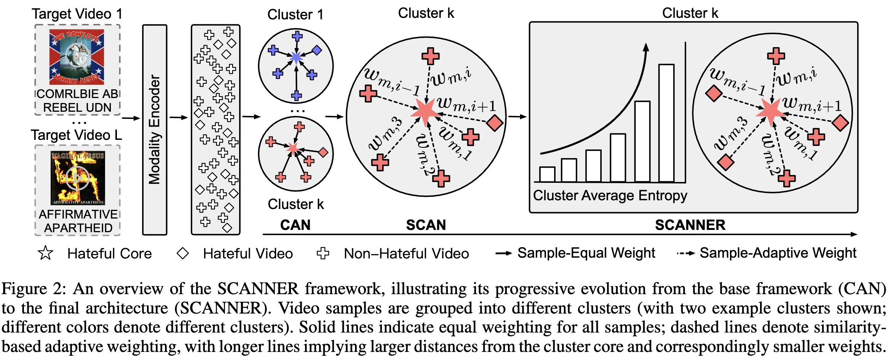

# SCANNER:  Sample-adaptive Centroid AligNment framework with iNtra-clustER collapse avoidance
This repo is the official implementation of *Shedding the Facades, Connecting the Domains: Detecting Shifting Multimodal Hate Video with Test-Time Adaptation* accepted by AAAI 2026 as oral.

## Abstract
Hate Video Detection (HVD) is crucial for online ecosystems. Existing methods assume identical distributions between training (source) and inference (target) data. However, hateful content often evolves into irregular and ambiguous forms to evade censorship, resulting in substantial semantic drift and rendering previously trained models ineffective. Test-Time Adaptation (TTA) offers a solution by adapting models during inference to narrow the cross-domain gap, while conventional TTA methods target mild distribution shifts and struggle with the severe semantic drift in HVD. To tackle these challenges, we propose SCANNER, the first TTA framework tailored for HVD. Motivated by the insight that, despite the evolving nature of hateful manifestations, their underlying cores remain largely invariant (i.e., targeting is still based on characteristics like gender, race, etc), we leverage these stable cores as a bridge to connect the source and target domains. Specifically, SCANNER initially reveals the stable cores from the ambiguous layout in evolving hateful content via a principled centroid-guided alignment mechanism. To alleviate the impact of outlier-like samples that are weakly correlated with centroids during the alignment process, SCANNER enhances the prior by incorporating a sample-level adaptive centroid alignment strategy, promoting more stable adaptation. Furthermore, to mitigate semantic collapse from overly uniform outputs within clusters, SCANNER introduces an intra-cluster diversity regularization that encourages the cluster-wise semantic richness. Experiments show that SCANNER outperforms all baselines, with an average gain of 4.69% in Macro-F1 over the best.

## Framework


## Dataset

You can obtain the datasets from the following project sites.

### HMM

Access the HMM dataset from [hate-alert/HateMM](https://github.com/hate-alert/HateMM).

### MHB and MHY

Access the MHY and MHB dataset from [Social-AI-Studio/MultiHateClip: Official repository for ACM Multimedia'24 paper "MultiHateClip: A Multilingual Benchmark Dataset for Hateful Video Detection on YouTube and Bilibili"](https://github.com/social-ai-studio/multihateclip).

## Usage

### Requirements

To set up the environment, run the following commands:

```bash
conda create --name py312 python=3.12
pip install torch transformers tqdm loguru pandas torchmetrics scikit-learn colorama wandb hydra-core
```

### Run

```shell
# Run SCANNER for the MHB to MHY dataset
python src/train.py --config-name ZH2EN

# Run SCANNER for the MHY to MHB dataset
python src/train.py --config-name EN2ZH
```

## Citation
If you find our research useful, please cite this paper:
```bib
@inproceedings{li2026shedding,
    author = {Li, Jiao and Lang, Jian and Tang, Xikai and Shu, Wenzheng and Zhong, Ting and Gao, Qiang and Wang, Yong and Chen, Leiting and Zhou, Fan},
    booktitle = {AAAI Conference on Artificial Intelligence (AAAI)},
    year = {2026},
    title = {Shedding the Facades, Connecting the Domains: Detecting Shifting Multimodal Hate Video with Test-Time Adaptation},
}
```